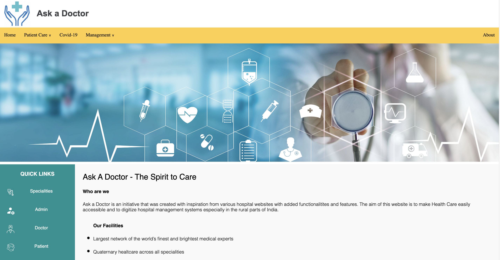
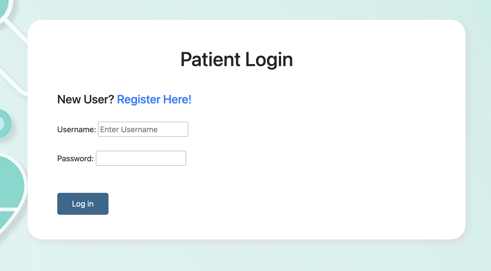
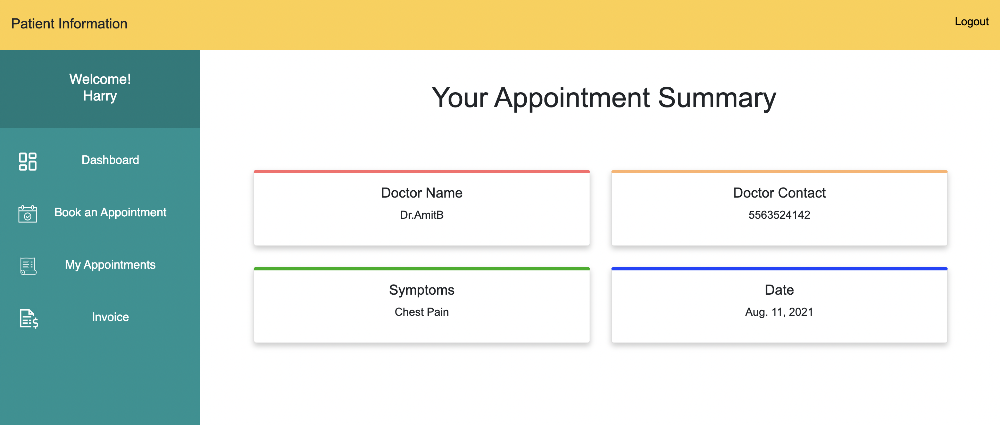
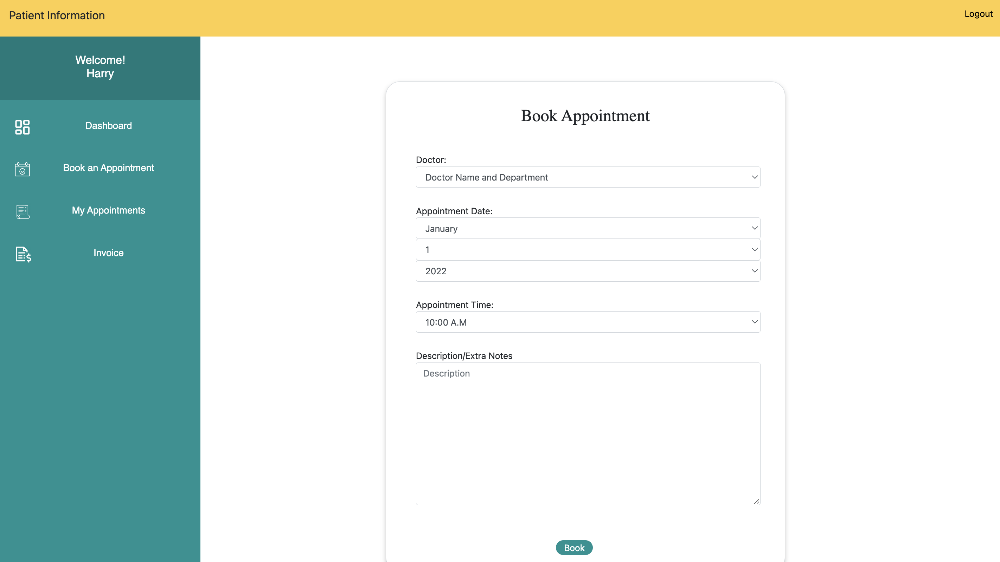
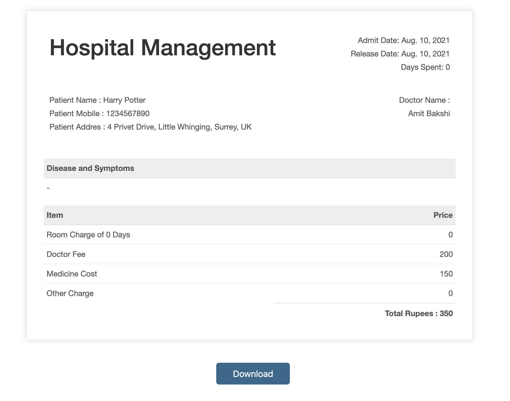

<h1 align="center">Ask-a-Doctor 🩺</h1>

<p align="center">
  <strong>A comprehensive healthcare management system built with Django.</strong><br>
  It enables seamless interactions between Patients, Doctors, and Administrators, simplifying appointment booking, approvals, and hospital management.
</p>

<p align="center">
  
</p>

---

## 🌟 Key Features

The application is divided into three core modules with role-based access control:

### 1. 👑 Admin Module
The central hub for hospital administration.
- **Secure Login:** Dedicated dashboard for hospital admins.
- **User Management:** Verify and approve newly registered patient and doctor accounts.
- **Records:** View comprehensive details of all patients and doctors.
- **Appointments:** Confirm, manage, or reject appointments booked by patients.
- **Billing:** Generate invoices and discharge patients.

### 2. 👨‍⚕️ Doctor Module
Dedicated portal for healthcare professionals.
- **Authentication:** Sign Up and Log In (requires Admin approval).
- **Patient Dashboard:** View details of assigned patients (symptoms, names, contact info).
- **Schedule Management:** View and manage appointments assigned by the Admin.

### 3. 🤒 Patient Module
User-friendly interface for patients seeking medical care.
- **Authentication:** Sign Up and Log In (requires Admin approval).
- **Doctor Directory:** View details of assigned doctors (specialization, contact info).
- **Appointment Booking:** Easily request appointments with specialized doctors.
- **Status Tracking:** Check the status of booked appointments (pending/confirmed).
- **Invoices:** View and download hospital bills/invoices as PDF files.

---

## 💻 Tech Stack

- **Backend:** Python, Django
- **Frontend:** HTML5, CSS3, JavaScript, Bootstrap 4
- **Database:** SQLite (default for development)
- **PDF Generation:** xhtml2pdf

---

## 🚀 Installation & Setup

Follow these steps to run the project on your local machine:

**1. Clone the repository**
```bash
git clone https://github.com/manjeet266/Ask-a-Doctor.git
cd Ask-a-Doctor
```

**2. Create a Virtual Environment (Recommended)**
```bash
python -m venv venv
# On Windows
venv\Scripts\activate
# On macOS/Linux
source venv/bin/activate
```

**3. Install Dependencies**
```bash
pip install -r requirements.txt
```

**4. Apply Database Migrations**
```bash
python manage.py makemigrations
python manage.py migrate
```

**5. Run the Development Server**
```bash
python manage.py runserver
```

**6. Access the Application**
Open your web browser and navigate to `http://127.0.0.1:8000/`.

---
 
## 📸 Application Screenshots

| Patient Login | Patient Dashboard |
| :---: | :---: |
|  |  |

| Book Appointment | Invoice Generation |
| :---: | :---: |
|  |  |

---
*Created as a final year academic project.*
